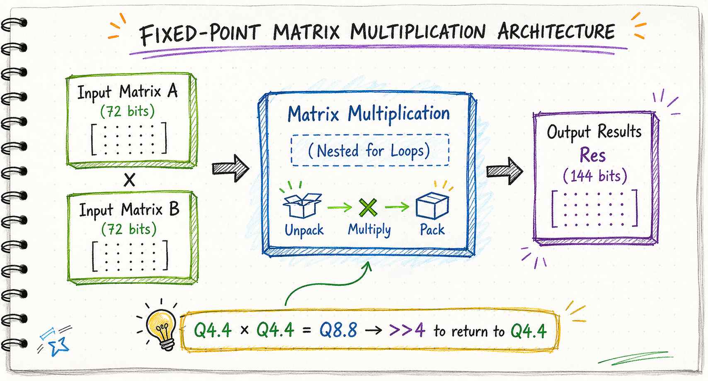
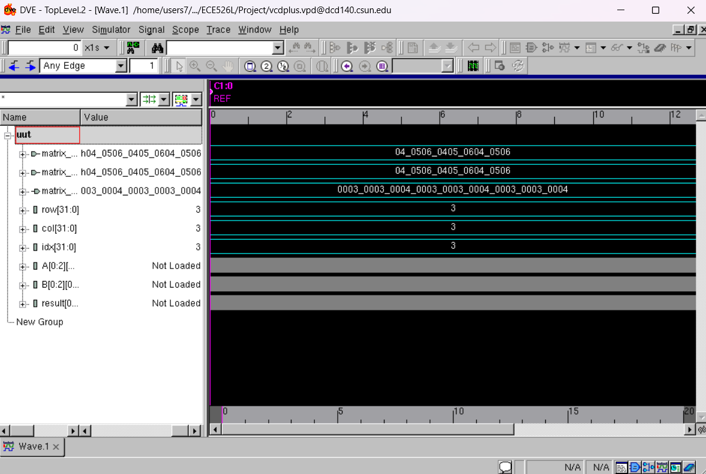

# Fixed-Point Matrix Multiplication

A 3×3 fixed-point matrix multiplier implemented in **Verilog** using **Q4.4 arithmetic** and verified with **Synopsys VCS** and **DVE**.

The design uses two 72-bit packed input matrices, performs combinational matrix multiplication using nested loops, rescales Q8.8 products back to Q4.4, and packs the final 3×3 result into a 144-bit output vector.

  &nbsp;
  &nbsp;
  &nbsp;
  

  

<em>3×3 Q4.4 matrix multiplication architecture with unpack, multiply, scale, and pack stages.</em>

---

## Key Features

- **3×3 fixed-point matrix multiplication** implemented in Verilog
- **Q4.4 input format** with 8-bit fixed-point values
- **Combinational architecture** with no clock dependency
- **Nested-loop computation** for matrix dot products
- **Q8.8 intermediate products** rescaled using a 4-bit right shift
- **72-bit packed inputs** for each 3×3 matrix
- **144-bit packed output** for the resulting matrix
- **Verification with Synopsys VCS and DVE**
- **Waveform analysis** to confirm correct arithmetic and packed results

---

## How It Works

1. **Unpack** — Each 72-bit input vector is unpacked into a 3×3 matrix of 8-bit Q4.4 values.
2. **Multiply** — Nested loops compute the dot product for each output element.
3. **Accumulate** — Intermediate multiplication results are summed for each matrix position.
4. **Scale** — Q8.8 results are shifted right by 4 bits to return to Q4.4 scaling.
5. **Pack** — The nine output values are packed into a 144-bit result vector.
6. **Verify** — The design is simulated in VCS and inspected in DVE.

---

## Fixed-Point Format

The project uses **Q4.4 fixed-point representation**, where:

- 4 bits represent the integer portion
- 4 bits represent the fractional portion
- Resolution is **1/16 = 0.0625**
- Q4.4 multiplication produces a **Q8.8** intermediate result
- A **4-bit right shift (`>> 4`)** is used to restore Q4.4 scaling

---

## Design Files

- `src/mat_mul.v` — Verilog RTL for the matrix multiplier
- `tb/mat_mul_tb.v` — testbench used to verify the design

---

## Verification & Results

The testbench applies two 3×3 matrices and compares the simulated output with the expected result.

For the test case documented in the project report, the expected result was:

    [3 3 4]
    [3 3 4]
    [3 3 4]

The simulated output matched the manually calculated expected result.

  

<em>Synopsys DVE waveform used to inspect the matrix inputs, intermediate values, and final output.</em>

---

## Performance Notes

- **Combinational implementation** is suitable for small matrix sizes
- **No clock latency** because the output responds directly to input changes
- **No BRAM usage** in the reported implementation
- **Triple-loop architecture** limits scalability for larger matrices
- Pipelining or iterative architectures could improve scalability and throughput

---

## Future Improvements

- Add pipelined computation stages
- Parameterize matrix dimensions
- Add signed/unsigned control
- Extend the design to 4×4 or NxN matrices
- Explore parallel implementations for higher throughput

---

## Academic Project

Developed for **ECE 526 — Digital Design with Verilog and SystemVerilog** at **California State University, Northridge**.
